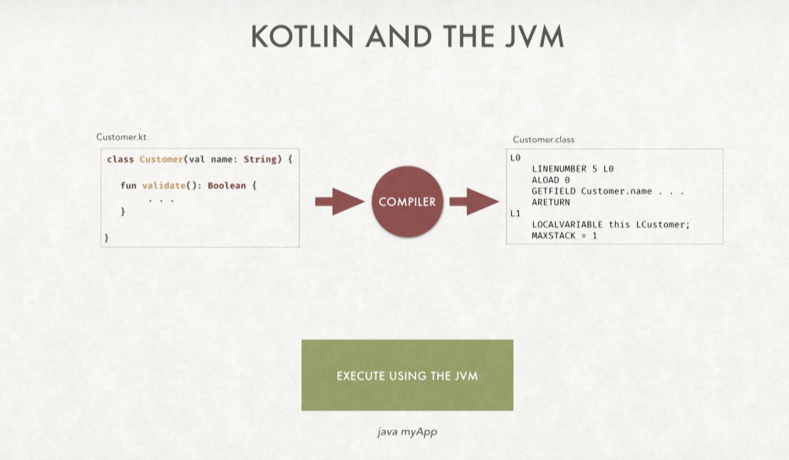
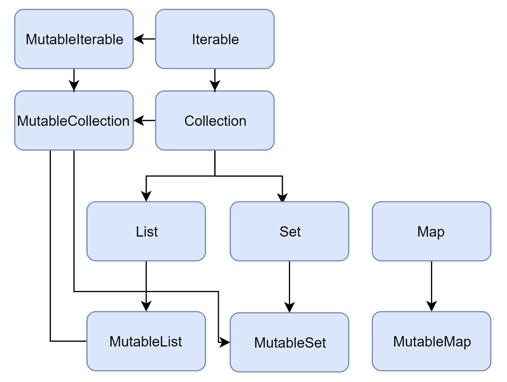
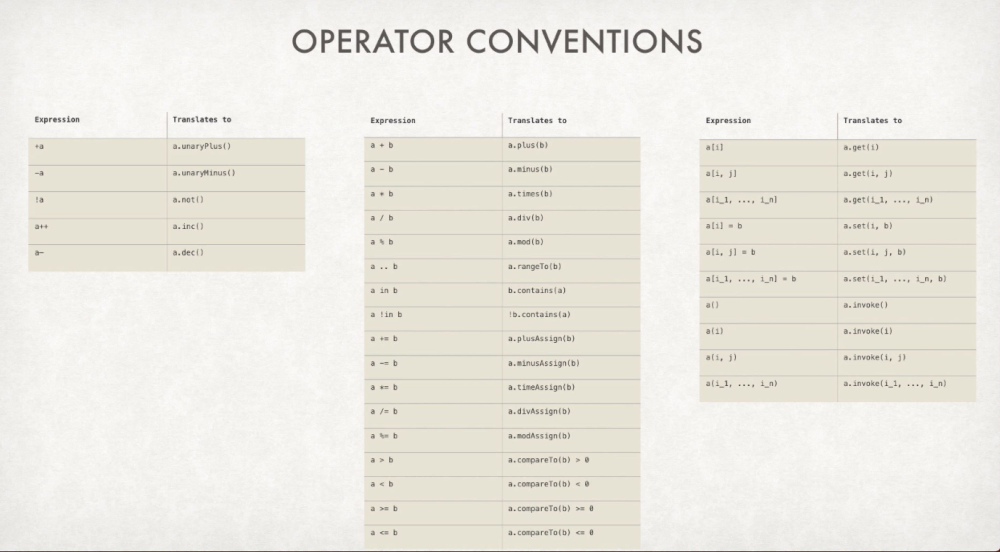
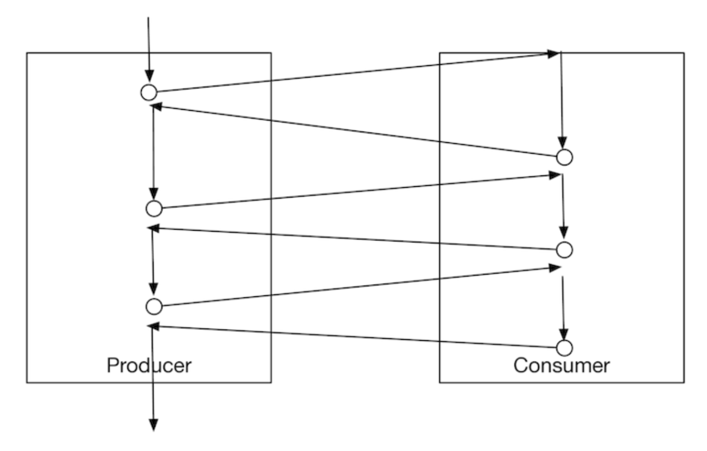

# Learning Kotlin
>
> Kotlin is a statically typed, fluent & elegant programming language that compiles to Java or JavaScript. 
> For a very quick start to Kotlin follow these links -
>
> - [Basic Syntax](https://kotlinlang.org/docs/reference/basic-syntax.html)
> - [Idioms](https://kotlinlang.org/docs/reference/idioms.html)
> - [Coding Conventions](https://kotlinlang.org/docs/reference/coding-conventions.html)
>
> This document is split into 2 parts - 
>   A. Introduction to Kotlin
>   B. Some advanced concepts 
> 
> My takeaways from Kotlin till now when compared to Java -
>
>   Key features: 
>    1. **null-safe** language - usage of nullable type - safe-call & elvis operators
>    2. **No checked exception** - Reduces clutter in code
>    3. **Extension Functions**
>    4. **Creating DSLs** using `infix` notation & lambda extensions
>    5. **Delegation**
>    6. **Coroutines**
>
>   Some more useful features:
>    1. Object destructuring
>    2. Using `data` class accompanied by _copy()_ method 
>    3. Smart casting
>    4. Using _default & named parameters_ in functions
>   

<br/> 

# **Part I - Introduction to Kotlin**

## 1. Basics

> In this section we will learn about some basic constructs about Kotlin. IntelliJ or Eclipse already have the Kotlin compiler so don't need to download it separately if we are using any of these IDEs.

 

### 1.a. Kotlin Compiler - `kotlinc` 

- `kotlinc` is the Kotlin Compiler. On Mac, Kotlin can be installed using brew which internally installs `kotlinc` by default under `/usr/local/bin/kotlinc` -
    ```shell script
        brew install kotlin
        ~ %which kotlinc
        /usr/local/bin/kotlinc
    ```  

- Once `kotlinc` is installed we can run Kotlin scripts on REPL or we can directly write programs and execute them. We'll take a look at both of them. 
  
### 1.b. Using Kotlin REPL

- Some examples of using the Kotlin REPL from Terminal -

    ```shell script
        ~ %kotlinc
        Welcome to Kotlin version 1.3.72 (JRE 1.8.0_251-b08)
        Type :help for help, :quit for quit
        >>> 2 + 2
        res0: kotlin.Int = 4
        >>> "Hello" +  "World"
        res1: kotlin.String = HelloWorld
        >>> fun greet(name: String) {println("Hello $name")}
        >>> greet("Arunav")
        Hello Arunav
        >>> fun multiLineGreet(name: String){
        ... println("Hello $name ! Hope you are doing great !")
        ... }
        >>> multiLineGreet("Sanjoy")
        Hello Sanjoy ! Hope you are doing great !
        >>> :quit
        ~ %
    ```

- Kotlin REPL can be run from IntelliJ Kotlin REPL, which provides syntax highlighting and suggestions for ease of use in REPL.

### 1.c. Compile and run a Kotlin program 
    
- Below is a sample kotlin program `Basics.kt` 
 
 
    ```kotlin
        fun greet(names: List<String>){
            print("Welcome ")
            for (name in names)
                print(name + ", ")
            println("to the world of Kotlin !")
        }
        
        fun main(){
            greet(listOf("Arunav", "Kaushik", "Sanjoy"))
        }
    ```
    
- In order to compile and execute the program as Java bytecode, we need to compile it using `kotlinc-jvm` and then run as  `kotlin` or `java` as shown below -    
    
    ```shell script
       ~ %kotlinc-jvm Basics.kt
       ~ %ls
       BasicsKt.class  META-INF 
       ~ %kotlin Basics
       Welcome Arunav, Kaushik, Sanjoy, to the world of Kotlin !
    ```

- Unlike languages like Java, Kotlin doesn’t require a statement or expression to belong to a method and a method to belong to a class, at least not in the source code we write. When the code is compiled, or executed as script, Kotlin will create wrapper classes and methods as necessary to satisfy the JVM expectations.

### 1.d. Variables - `var` & `val`

- Immutable variables are defined as `val` and mutable variables are defined as `var`
- The type is automatically determined by Kotlin if not specified


    ```kotlin
        var name="Arunav"
        var age=Int
        age = 20
        name = "Madhuri"
        val address=String
        address = "Phoenix, Arizona"    
    ```  

### 1.e. Equality Check 

- **Structural Equality**: `equals()` method in Java, or `==` operator in Kotlin, is a comparison of values, called structural equality.

- **Referential Equality**: `==` operator in Java, or `===` in Kotlin, is a comparison of references, called referential equality. Referential equality compares references and returns true if the two references are identical—that is, they refer to the same exact instance.

    ```kotlin
        println("hi" == "hi")  // true 
        println("hi" == "Hi")  // false
        println(null == "hi")  // false
        println("hi" == null)  // false
        println(null == null)  // true
    ```
### 1.f. Basic Data Types

- In Kotlin everything is an object. 
- The different data types in Kotlin are - **Numbers, Characters, Booleans, Arrays, Unsigned integers, Strings**.
- There is no implicit type conversion. Using helper functions we can do type conversion.  
- There are different literal constants for integral values for -
    - Decimal (123)
    - Long (123L)
    - Hexadecimal (0x0F)
    - Binary (0b00001011)
    - Double (123.5)
    - Float (123.5f)
- We can use underscores in numerical literals to make it more readable
    `val oneMillion = 1_000_000`

- Similar to Java, `Char` and is written inside single quotes on the other hand `String` is written inside double quotes.
- Multi-line `String` can be written inside a pair of 3 double quotes """ 


    ```kotlin
        val multiLineString = """
            Hello there, 
            How are you ?
            """
    ```    
- String literals can contain template expressions, i.e. pieces of code that are evaluated and whose results are concatenated into the string. A template expression starts with a dollar sign ($) and consists of either a simple name: 
    ```
        val person = "Name: $name; Age: $age; Address: $address"
    ```     
[Additional Reading](https://kotlinlang.org/docs/reference/basic-types.html)

### 1.g. Loops & Ranges

- Traditional `for`, `while`, `do..while` loops are supported in Kotlin
- `break` and `continue` also are supported
- We can use ranges inside for loops
    - `..` : Incrementing 
    - `downTo` : Decrementing
    - `step` : no. of steps increment or decrement can happen
- For skipping values without a particular rythm we can use the `filter()` method 
    
    ```kotlin
        val oneToFive: IntRange = 1..5
        // IntRange
        for (i in oneToFive) {
            println(i)
        }
    
        val aToe: CharRange = 'a'..'e'
        //CharRange
        for (i in aToe) {
            println(i)
        }
    
        // ClosedRange - range of Strings
        val seekHelp: ClosedRange<String> = "hell".."help"
        println(seekHelp.contains("helm"))   // true
        println(seekHelp.contains("hello"))  // true
        println(seekHelp.contains("helo"))   // true
        println(seekHelp.contains("hels"))   // false
  
        for (i in 1..10) {
            println(i)
        }
        for (i in 1..10 step 3) {
            println(i)
        }
        for (i in 10 downTo 1 step 2) {
            println(i)
        }
        // Using filters in ranges
        for (i in (1..12).filter { it % 3 == 0 || it % 5 == 0 }) {
            println(i) //3, 5, 6, 9, 10, 12
        }  
    ```
- We can use label to break out of all the nested loops

### 1.h. Conditionals 

- In Kotlin, `if` can be used as a statement or an expression. When used as expression it returns a value and hence there is no separate ternary operator.
- Instead of switch statements, we have `when` statements in Kotlin. default case is referred as `else`.
- When `if` and `when` are used as expression, the `else` is mandatory. 


    ```kotlin
        fun whenStatement(str: String) {
            when(str){
                "Red" -> println("The color code is 4")
                "Blue" -> println("The color code is 8")
                else -> println("Couldn't find the color code")
            }
        }
        
        fun whenExpression(dayOfWeek: Any) = when (dayOfWeek) {
            "Saturday", "Sunday" -> "Relax"
            in listOf("Monday", "Tuesday", "Wednesday", "Thursday") -> "Work hard"
            in 2..4 -> "Work hard"
            "Friday" -> "Party"
            is String -> "What?"
            else -> "No clue"
        }
                
        fun ifConditions() {
            val a = 30
            val b = 20
        
            val result = if (a > b){
                "a is greater than b"
            } else {
                "b is greater than a"
            }
            println(result)
        }
    ```
    
[Additional Reading](https://kotlinlang.org/docs/reference/control-flow.html)  

### 1.i. Packages 

- By default Kotlin imports a number of packages.
- Depending on target platform, additional packages are imported for JVM and JS.
- The syntax for specifying a package and importing from a package are similar to what we have in Java.
- A source file may start with a package declaration.
- Apart from the default imports, each file may contain its own import directives.
- If there is a name clash, we can disambiguate by using `as` keyword to locally rename the clashing entity.


    ```kotlin
        import org.example.Message // Message is accessible
        import org.test.Message as testMessage // testMessage stands for 'org.test.Message'
    ```

[Additional Reading](https://kotlinlang.org/docs/reference/packages.html)

<br/>

  
## 2. Intro to Functions

> In this section, we'll be doing an introduction to functions in Kotlin 

### 2.a. Have `fun` in Kotlin

- Functions in Kotlin are prefixed with `fun`
- Some return types in function -
    - `Unit` : This is the default return type. Unit is kind of equivalent to void in other languages. But in kotlin we can check if the value of a variable is `Unit`.
    - `Nothing` : Nothing is a return type when a function returns exception. `Nothing` is substitutable for any class including `Int`, `Double`, `String`, etc.
- In Kotlin, we can’t say `val` or `var` for parameters, they’re implicitly `val`, and any effort to change the parameters’ values within functions or methods will result in compilation errors.    
- **Single expression** function doesn't need a function block
- If a block body is assigned as a single expression function, Kotlin will treat that as a lambda expression or an anonymous function. Check out the below examples. 


    ```kotlin
      fun f1() = 2
      fun f2() = { 2 }
      fun f3(factor: Int) = { n: Int -> n * factor }
            
      println(f1()) //2
      println(f2()) //() -> kotlin.Int 
      println(f2()()) //2
      println(f3(2)) //(kotlin.Int) -> kotlin.Int        
      println(f3(2)(3)) //6
    ```

### 2.b. Default & Named Parameters

- We can pass **default** parameters to function arguments
- The default argument doesn’t have to be a literal; it may be an expression. Also, you may compute the default arguments for a parameter using the parameters to its left.
- In case of ambiguity in case of multiple parameters & default value being used in some cases, then the calling part of the function can use **named** parameters.
- Also the ordering of the functions can be in any sequence when using named parameters 


    ```kotlin
        fun person(name: String, address: String = "", email: String = "$name${name.length}@kotlin.lang", phone: String) {
            println("Name=$name, Address=$address, Email=$email, Phone=$phone")
        }
    ```
    
### 2.c. Unlimited Parameters - `vararg`

- When a function parameter is specified as `vararg` it means it can have unlimited number of parameters.
- In case of passing vararg to another function we can use the **spread operator (\*)**.


    ```kotlin
        fun greetPeople(vararg names: String) {
            print("Welcome ")
            printNames(*names)
            println("to the world of Kotlin using vararg")
        }
        fun printNames(vararg names: String) {
            for (name in names)
                print("$name, ")
        }
    ```

[Additional Reading](https://kotlinlang.org/docs/reference/functions.html)

<br/> 

## 3. Collections

> We'll explore different types of collections in Kotlin, including 
> - Tuples - Pair & Triple
> - Array
> - List
> - Set
> - Map

### 3.a Tuples - `Pair` & `Triple`

- Tuples are sequences of objects of small, finite size.
- `Pair` is a tuple of size two and `Triple` is a tuple of size three.
- Both `Pair` & `Triple` are immutable. For mutability we can use `Array`.

    ```kotlin
       println(Pair("Tom", "Jerry"))
       println(Triple("Tom", "Dick", "Harry"))    
    ```

### 3.b. Arrays

[Arrays](https://learning.oreilly.com/library/view/programming-kotlin/9781680507287/f_0044.xhtml)

### 3.c. Lists

[Lists](https://learning.oreilly.com/library/view/programming-kotlin/9781680507287/f_0045.xhtml)

### 3.d. Sets

[Sets](https://learning.oreilly.com/library/view/programming-kotlin/9781680507287/f_0046.xhtml)

### 3.e. Maps

- The key-value pairs are created using the `to()` extension function, available on any object in Kotlin. 
- Using `mapOf()`, that takes a vararg of `Pair<K, V>`, we can create a map of key-values of different objects.


[Maps](https://learning.oreilly.com/library/view/programming-kotlin/9781680507287/f_0047.xhtml)

<br/>

## 4. Type Safety & Null Handling

### `Any`

- All classes in Kotlin extend from the base class `Any` similar to `Object` class in Java.
- Methods like `hashCode()`, `equals()` and `toString()` are already implemented in `Any`.
- In addition to these, `Any` has extension functions like `to()`, `let()`, `run()`,`apply()`, `also()`.  

### `Nothing`

- When a function returns nothing, the corresponding return type in Kotlin is `Nothing`. There is nothing similar in Java.
- `Nothing` actually returns nothing, not even `void` (or `Unit` in Kotlin). `Nothing` is literally deeper than `void`.
- `Nothing` can be substituted for any class (`Int`, `Double`, etc).
- When used as a function return type that means that the function call will result in an exception.

    ```kotlin
      fun computeSqrt(n: Double): Double { 
          if(n >= 0) {
              return Math.sqrt(n) 
          } else {
              throw RuntimeException("No negative please") 
          }
      }
    ```
- In the above example `if` returns `Double`, but the `else` throws an Exception.

### `null` Handling

- By default all objects in Kotlin is defined as not nullable unless specified otherwise. Every non-nullable Koltin object have a nullable counterpart. The nullable types have a `?` suffix.
- Kotlin does `null` check during compile time -
    - If the return type of a function is not defined as nullable and the function is returning `null`, the Kotlin code doesn't compile and throws an error.
    - If `null` is passed in a function parameter when the parameter in the function is defined as not nullable.
- **Safe-Call `(?.)` Operator**: The `null` check and call to a method or property can be merged in a single step using the `?.` operator. If the reference is `null`, the safe-call operator will result in `null`, otherwise the result will be the result of the method call or property.

    ```kotlin
      fun getNickName(name: String?) : String? {
          return name?.reversed()?.toUppercase()
      }
    ```
  
- **Elvis `(?:)` Operator**: If we want to return something instead of `null`, when the reference is `null`, we can do that using the Elvis operator.

    ```kotlin
      fun getNickName(name: String?): String {
          return name?.reversed()?.toUppercase()?:"What's there in a name ?"
      }
    ```
 
- **Unsafe Assertion `(!!)` Operator**: It is NOT advisable to use this operator. This operator tells Kotlin compiler that it doesn't have to do any `null` check on a particular reference during compile time. If that reference is `null` during runtime and we are calling a method or property on that reference then that will result in a `NullPointerException` at runtime.

    ```kotlin
      fun getNickName(name: String?): String {
          return name!!.reversed().toUppercase()
      }
    ```

### Type Checking & Casting

- Using the `is` operator we can do type-checking in Kotlin.
- Once Kotlin determines the type during compile-time, Kotlin does a smart cast wherever possible.
- Similarly, once an object reference is not `null`, it can apply smart casts to automatically cast a nullable type to a non-nullable type, saving an explicit cast. 

    ```kotlin
    fun whatToDo(dayOfWeek: Any) = when (dayOfWeek) {
      "Saturday", "Sunday" -> "Relax"
      in listOf("Monday", "Tuesday", "Wednesday", "Thursday") -> "Work hard" 
      in 2..4 -> "Work hard"
      "Friday" -> "Party"
      is String -> "What?"
      else -> "No clue"
    }
    ```
- Using the `as` and `as?` operator we can do explicit type-casting in Kotlin. This might be required when Kotlin compiler is unable to do a smart cast.
- In Kotlin there is nothing as implicit casting. It either has to be a smart cast or an explicit cast.

<br/>

## 5. Generics

- We can think of of objects from which we always _read_ as **Producers** and the ones we _write_ as **Consumers**. To remember this, we can use a mnemonic PECS (Producer -> extends and Consumer -> super).

### Invariance

- Let's say the class `Dog` is inherited from the class `Animal`. Any method that is expecting an `Animal` will be happy if we pass `Dog`, but if we try to pass `MutableList<Dog>` where `MutableList<Animal>` is expected, Kotlin compiler will throw an error. This is true in case of Java `List<>` as well. The reason for this compilation error is because the list being a mutable one, we can add an instance of another animal, lets say `Cat` in the `MutableList<Animal>`. If a MutableList<Dog> is passed to MutableList<Animal> , then whenever a `Cat` is added to the list it will throw a ClassCastException at runtime, instead it is throwing the error at compile time itself. This is called type invariance, i.e., we cannot vary on the type, i.e., `List<Dog>` is not a subtype of `List<Animal>`.  


### Covariance

- Sometimes you want the compiler to permit _covariance_ — that is, tell the compiler to permit the **use of a derived class** of a parametric type `T` in addition to allowing the type `T`, but without compromising type safety. In Java you use the syntax `<? extends T>` to convey _covariance_, but there’s a catch. You can use that syntax when you use a generic class, which is called _use-site variance_ or _type-projection_, but not when you define a class, which is called _declaration-site variance_. In Kotlin you can do both.

- The `out` modifier tells the Kotlin compiler that items can only be read out of the Generic class, and hence it allows derived classes to be passed as parameter by still maintaining type safety.

### Contravariance

- Other times you want to tell the compiler to allow _contravariance_ — that is, **permit a super class** of a parametric type T where type T is expected. Once again, Java permits _contravariance_, with the syntax `<? super T>` but only at use-site and not declaration-site. Kotlin permits contravariance both at declaration-site and use-site.


<br/>

## 4. Classes

> Kotlin is an object oriented language and it supports all the different features of object-oriented programming. In this section, we'll get started with the OO concepts in Kotlin.

### 3.a. `class` & `construtor`

- `class`:  
    - Classes can be defined with or without any {}.
    - Classes has properties and not fields. Properties can be defined as `val` or `var`.
    - To create instances of classes, we can simply call the Class using the className. There is no `new` keyword in Kotlin.
    - **All properties needs to be initialized if they are not passed using constructor**.
    - We can define member functions inside classes similar to how we defined functions. It will have access to all the properties inside the class.
    
- `constructor`:    
    - Constructor properties can have **default** or **named** parameters similar to functions.
    - We can initialize properties inside an `init{}` block of code inside the class.
    - Secondary constructors can be created by using the `constructor` keyword. 
    - If the class has a primary constructor, each secondary constructor needs to **delegate to the primary constructor**, either directly or indirectly through another secondary constructor(s) using the `this` keyword.
    - `var` is not allowed inside secondary constructors.
    - If parameter passed inside constructor is not defined as `val` or `var`, it can still be a parameter, but not a property of the class.

    ```kotlin
        class Customer(var id: Int = -1, var name: String) {
            var email: String = ""
            init {
                name = name.toUpperCase()
            }
            constructor(id: Int = -1, name: String, email: String) : this(id, name) {
                if (email == "")
                    this.email = "$name@example.com"
                else
                    this.email = email
            }
           fun printCustomer() {
                println("id=${id}, name=${name}, email=${email}")
            }            
        }
    ```

[Additional Reading](https://kotlinlang.org/docs/reference/classes.html)

### 3.b. Custom Getters & Setters

- The full syntax for declaring a property is 
 
    ```kotlin
      var <propertyName>[: <PropertyType>] [= <property_initializer>]
          [<getter>]
          [<setter>]
    ```      
  
- We can create custom getters and setters inside kotlin classes by using the `get()` and `set()` methods with each properties.
- `field` is a special keyword in Kotlin that is used to set a value to a property.


    ```kotlin
        class Employee(val id: Int = Random.nextInt().absoluteValue, val name: String, val yearOfBirth: Int) {
            var age: Int = 0
                get() = Calendar.getInstance().get(Calendar.YEAR) - yearOfBirth
            var ssn: String = ""
                set(value) {
                    field = value
                }
        }
    ```

[Additional Reading](https://kotlinlang.org/docs/reference/properties.html)

### 3.c. Visibility Modifiers

 

[Additional Reading](https://kotlinlang.org/docs/reference/visibility-modifiers.html)

### 3.d. `data` Classes

- In order to reduce verbose code, Kotlin has `data` classes which automatically derives -
    - `equals()` / `hashCode()`
    - `toString()`
    - `copy()`
- Data classes must fulfill the following requirements -
    - The primary constructor needs to have at least one parameter
    - All primary constructor parameters need to be marked as `val` or `var`
    - Data classes cannot be abstract, open, sealed or inner
- We can `override` and provide explicit implementations of `equals()`, `hashCode()` or `toString()` in the `data` class body. These functions are not generated then and the explicit implementations are used;
- `copy()` function can be used to copy an object altering some of its properties, but keeping the rest unchanged. 


    ```kotlin
      data class EmployeeData(var id: Int, var name: String, var email: String) {
          override fun toString(): String {
              return super.toString()
          }
      }
      fun main() {
      
          val e1 = EmployeeData(1, "Ram", "ram@gmail.com")
          val e2 = EmployeeData(2, "Shyam", "shyam@gmail.com")
    
          val e3 = e1.copy(email = "ram2@gmail.com")
      }    
    ```

### 3.e. `enum` Classes

- Enum classes are used for creating a bunch of enumerated values. 
- We can customize and iterate over them as well.
- Each `enum` constant is an object. Enum constants are separated with commas.
- Enum constants can override base methods.
- **When enum class has any members, the enum constants must be separated from the member definitions with a semicolon.**


    ```kotlin
        enum class ProtocolState {
            WAITING {
                override fun signal() = TALKING
            },
            TALKING {
                override fun signal() = WAITING
            };
            abstract fun signal(): ProtocolState
        }
    ```
    
### 3.f. Objects

- In Kotlin we can directly create an object without creating a class.
- Provides an easy way to create singletons.
- Objects in an expression are initialized immediately, whereas object declarations are lazily instantiated.  

    ```kotlin
        object Circle{
            var radius = 2
        }
        fun draw(){
            var rectangle = object {
                val length = 10
                val breadth = 7 
            }
            println("Drawing Rectangle of length ${rectangle.length} and breadth ${rectangle.breadth}")
            println("Drawing Circle of radius ${Circle.radius}")
        }
    ```

<br/> 

## 4. Inheritance 

> We'll extend the OO concepts in Kotlin by looking into Inheritance, Interfaces, Abstract classes & Generics.

- Base class in Kotlin is `Any`, similar to `Object` is Java. All classes are inherits from `Any`. 
- By default all classes are `final`. In order to make a class non-final we need to make it `open`.
- Similarly members are also by default final. In order to override in the child class, we need to make the method `open` in the parent class.
- `data` classes can also be inherited in Kotlin.

    ```kotlin
        open class Person() {
            open fun validate() {
                println("Validating in Person")
            }
        }        
        open class Customer : Person {
            final override fun validate() {
                println("Validating in Customer")
            }
            constructor() : super() {
                println("Inside Customer constructor")
            }
        }
        data class SpecialCustomer(var id: Int) : Customer()
    ```
  
### 4.a. Abstract Classes

- Similar to Java

    ```kotlin
        abstract class AbstractEntity {
            // Having a state inside abstract class
            val isActive = true
        
            // Abstract method
            abstract fun load()
        
            // Default method
            fun status(): String {
                return isActive.toString()
            }
        }
        
        class EmployeeEntity : AbstractEntity() {
            override fun load() {
                println("Loading EmployeeEntity..")
            }
        }
    ```

### 4.b. Interfaces

- Similar to Java 8 onwards. 
- Can have default implementations.
- Can define abstract properties but cannot have a state for it.
- However, we can define custom getters and setters on interface properties. But properties inside interfaces doesn't have a backing `field`.

    ```kotlin
        interface CustomerRepo {
            // Interfaces cannot maintain state, but can have custom getters & setters
            var isEmpty : Boolean
                get() = true
                set(value){
                    println("Doing something with the value $value")
                }
            // This is a default implementation
            fun load(obj: Customer){
                println("Loading Customer Data")
            }
        
            fun getById(id: Int) : Customer
        }
    ```

- When a class implements multiple interfaces, say A and B, and both have a method with the same name, say foo(), then Kotlin provides a way for the implementing class to resolve the conflict by specifying the interfaces in Angular brackets <>.

    ```kotlin
        interface A {
            fun foo() { print("A") }
            fun bar()
        }
        interface B {
            fun foo() { print("B") }
            fun bar() { print("bar") }
        }
        class C : A {
            override fun bar() { print("bar") }
        }
        class D : A, B {
            override fun foo() {
                super<A>.foo()
                super<B>.foo()
            }
            override fun bar() {
                super<B>.bar()
            }
        }
    ```

> **Difference between Abstract Classes and Interfaces**:
>   
> In both abstract classes and interfaces, we can define abstract methods as well as provide default implementation of some methods. But below are the major differences between them - 
>   - In abstract classes we can maintain state, but in interfaces we cannot. We can define properties inside an interface, but we cannot maintain value or state inside it.
>   - Secondly we can have a class that implements multiple interfaces, but it can extend only one class. 
>   

[Additional Reading](https://kotlinlang.org/docs/reference/interfaces.html)

### 4.c. Generics

- Similar to Java. Will revisit later in details.

    ```kotlin
        interface Repository<T> {
            fun getById(id: Int): T
            fun getAll(): List<T>
            fun<U> getAddDataById(id: Int) : U
        }
        
        class GenericRepo<T> : Repository<T> {
            override fun getById(id: Int): T {
                println("Getting by id = $id ")
                throw UnsupportedOperationException("Not implemented")
            }
            override fun getAll(): List<T> {
                println("Fetching all")
                throw UnsupportedOperationException("Not implemented")
            }  
            override fun <U> getAddDataById(id: Int): U {
                println("Getting additional data by Id")
                throw UnsupportedOperationException("Not implemented")
            }
        }
        
        fun main() {
            val customerRepo = GenericRepo<Customer>()
            val employeeRepo = GenericRepo<EmployeeEntity>()
            customerRepo.getById(10)
            employeeRepo.getAll()
            employeeRepo.getAddDataById<EmployeeAddData>(22)
        }
    ```

<br/> 

## 5. Nulls

- Kotlin is a null-safe language.
- We cannot return `null` from a function nor pass `null` as an argument in Kotlin.
- Every non-nullable type has a nullable counterpart suffixed by `?`
- In order to return a `null` from a function the return type can be changed to its nullable counterpart by suffixing with `?`.

    ```kotlin
      fun nickName(name: String?) : String? {}
    ```
  
- Kotlin requires method calls on nullable references to be prefixed with either the safe-call operator or the non-null assertion operator.
    - **Safe-call operator (?):** The null-check and call to a method or a property can be done using the Safe call operator in one step. If the reference is null, then the safe-call operator will return null. But when using the **Elvis Operator (?:)**, we can return a default value in case of null.
  
        ```kotlin
          return name?.reversed()?.toUpperCase()?:"Joker"
        ```
      
    - **Non-Null operator (!!) : DO NOT USE THIS OPERATOR.** This operator can be used when we don't want Kotlin to do a null check. 

[Kotlin Docs - Null Safety](https://kotlinlang.org/docs/reference/null-safety.html)    
[Additional Reading](https://learning.oreilly.com/library/view/programming-kotlin/9781680507287/f_0051.xhtml)
    
<br/> 

## 6. Some useful language constructs

> In this section we will take a look at some of the useful language constructs that Kotlin provides, which will help us deepen our understanding of the further sections

### 6.a. Type casting

- We can check whether an object conforms to a given type at runtime by using the `is` operator or its negated form `!is`
- **Smart Casts:**
    - The Kotlin compiler tracks `is`-checks and explicit casts for immuatable values and automatically inserts safe-casts

        ```kotlin
            fun demo(x: Any) {
                if (x is String) {
                    print(x.length) // x is automatically cast to String
                }
            }
        ```
    
    - The compiler is smart enough to know a cast to be safe if a negative check leads to a return

        ```kotlin
            if (x !is String) return            
            print(x.length) // x is automatically cast to String
        ```
              
    - or in the right-hand side of `&&` and `||`

        ```kotlin
            // x is automatically cast to string on the right-hand side of `||`
            if (x !is String || x.length == 0) return
        ```
      
    - Such smart casts work for when-expressions and while-loops as well
    
        ```kotlin
            when (x) {
                is Int -> print(x + 1)
                is String -> print(x.length + 1)
                is IntArray -> print(x.sum())
            }
        ```  
      
- **Safe (nullable) cast operator:**
    - Illegal casting throws an exception. Such casting is called unsafe cast. Unsafe cast is done in Kotlin using the **infix operator `as`**.
    - To avoid unsafe cast we can use safe cast using **as?** that returns `null` on failure

        ```kotlin
          val x: String? = y as String?
        ```
      
[Additional Reading](https://kotlinlang.org/docs/reference/typecasts.html)

### 6.b. Tuples - `Pair` & `Triple`

- Kotlin provides two specific types: `Pair` for a tuple of size two and `Triple` for a size of three to quickly create two or three objects as a collection

    ```kotlin
          println(Pair("Tom", "Jerry"))
    ```
- Both `Pair` and `Triple` are immutable and are useful to create a grouping of two and three values, respectively.
- For creating more than three immutable values, then `data` class is the option.

[Additional Reading](https://learning.oreilly.com/library/view/programming-kotlin/9781680507287/f_0043.xhtml#sec.pair)

### 6.c. Destructuring

- Destructuring is to extract values into variables from an existing object.
- The destructuring in Kotlin is based on the position of properties. In JavaScript object destructuring is based on name of properties. 
- We can skip properties while destructuring by putting underscores`(_)`

    ```kotlin
        fun getFullName() = Triple("John", "Quincy", "Adams")
        val (first, middle, last) = getFullName()
        val (f,_, l) = getFullName()    
    ```

[Additional Reading](https://kotlinlang.org/docs/reference/multi-declarations.html)

### 6.d. Exceptions 

- All exception classes in Kotlin are descendants of the class `Throwable`.
- Kotlin does not have checked exceptions.
- Every exception has a message, stack trace and an optional cause.
- Sample exception block

    ```kotlin
        try {
            // some code
        }
        catch (e: SomeException) {
            // handler
        }
        finally {
            // optional finally block
        }
    ```
  
- `try` is an expression, i.e., it can return a value
- The returned value of a try-expression is either the last expression in the `try` block or the last expression in the `catch` block (or blocks). Contents of the `finally` block do not affect the result of the expression.
- `throw` is an expression in Kotlin that returns a special type `Nothing`.

    ```kotlin
        fun fail(message: String): Nothing {
            throw IllegalArgumentException(message)
        }
        val s = person.name ?: fail("Name required")
        println(s)     // 's' is known to be initialized at this point
    ```
  
[Additional Reading](https://kotlinlang.org/docs/reference/exceptions.html)

<br/> 

## 7. Functional Style

> We'll get functional in this section. Learn about some key concepts how Kotlin supports functional programming.

### 7.a. Higher Order Functions

- A higher order function is a function that can takes a function as an argument, or return a function.  
- In Kotlin, method references are denoted as `::` and lambda expressions are expressed with "->", similar to Java.
- We can pass a method reference or a lambda expression to a function that accepts a function as an argument.


### 7.b. Lambda Expressions

- For single parameter in a lambda expression, we don't have to explicitly define the parameter in the lambda expression. Instead we can refer to the parameter as `it` in the body of the expression. Let's see an example -

    ```kotlin
        someFunc(3, {x -> x*x})
        someFunc(3, {it * it})
    ```
  
- **Dropping the brackets** when calling higher-order function:  
     - When the last or the only parameter of a function is a function, then when calling the higher-order function, the function parameter can be passed outside the parentheses of the function call

    ```kotlin
        operation(5) { it * it }
    ```

- In lambdas as well we can use object destructuring

### 7.c. Closures

- A lambda expression or anonymous function (as well as a local function and an object expression) can access its closure, i.e. the variables declared in the outer scope, also known as *lexical scoping*. 
- The variables captured in the closure can be modified in the lambda. Such a lambda is called closure.

> **Note**
>
> Keep closure as pure functions to avoid confusion and to minimize errors

[Additional Reading](https://kotlinlang.org/docs/reference/lambdas.html)

### 7.d. Extension Functions

- Extension function allows extending functionality of class without inheriting from it.
- Scope of exception functions is packages. In order to use outside the package, we need to import the package with the extension function.
- Member function takes precedence over extension function when both have same names and definition.
- Extensions are resolved **statically**. By defining an extension, we do not insert new members into a class, but merely make new functions callable with the dot-notation on variables of this type.

> Note :
>   - There needs to be a discipline when using extension methods

[Additional Reading](https://kotlinlang.org/docs/reference/extensions.html)

<br/> 

## 8. Interoperability

> Kotlin is 100% interoperable with Java. Its 2 way - Java to Kotlin and Kotlin to Java as well.

### 8.a. Java in Kotlin

[Additional Reading](https://kotlinlang.org/docs/reference/java-interop.html)

### 8.b. Working with nulls from Java

- Java nullable types become Platform types in Kotlin

### 8.c. Kotlin in Java

- Properties in Kotlin will automatically be converted to corresponding get() and set() methods when the same is used inside a Java class.
- **`@JvmField`**: For properties defined inside Kotlin code to be accessible from Java, this annotation in Kotlin code will help discover the property in Java code
- **`@JvmOverloads`**: For default parameters defined in Kotlin methods, Java won't have direct access to the overloaded method without specifying value for the default parameter. With `@JvmOverloads` annotation on the Kotlin method, Java class will now have access to the overloaded method without that particular default parameter. 
- **`@JvmName`**: Kotlin provides us with a feature of having a different name to a particular method when a method is referenced inside a Java code by using the `@JvmName` annotation.
- **`@Throws`**: When an exception is thrown from a method in Kotlin, the same needs to be annotated with `@Throws` in order for the Java class to handle it.

[Additional Reading](https://kotlinlang.org/docs/reference/java-to-kotlin-interop.html)


### 8.d. Top-level functions & properties in Kotlin

- Top level functions when compiled by default generates a bytecode file with name <filename>Kt.class. 
- In order to reference these functions inside Java we can simply call the function as <filename>Kt.functionName().
- In order to change the name of the default class name we can use the annotation at the top of the Kotlin file -

    ```kotlin
      @file:JvmName("MyKotlinClass")
    ```
  
- Top level properties can again be accessed by default using get() and set() methods inside Java.
- In case we want to access the property as a field name in Java class, then the same needs to be prefixed using `const` in the Kotlin file.

### 8.e. Extension functions from Java

- Extension functions can be accessed from Java using the Kotlin-className.functionName() similar to accessing a static method in Java.

<br/> 

## 9. Standard Library

### 9.a. Kotlin Std Library & Collections



- Kotlin has a very small standard library (~800Kb).
- Kotlin does not have its own collections. What it has is some interfaces on top of Java collections - 
    - Mutable 
    - Immutable
- Collections are 
    - List
    - Array (including equivalent primitive type)
    - Set
    - Map
    - HashMap
    - HashSet, etc...
    
- Use Kotlin helper functions when working with Collections. It automatically determines which class to call. For example when defining an empty list using `emptyList<>()`, it uses `kotlin.collections.EmptyList`, whereas when defining using `Arrays.asList()` it uses `java.util.Arrays$ArrayList`

[Additional Reading](https://kotlinlang.org/docs/reference/collections-overview.html)
    
### 9.b. Collection Common Operations

- Common operations are available for both read-only and mutable collections. Common operations fall into these groups:
    - [Transformations](https://kotlinlang.org/docs/reference/collection-transformations.html)
    - [Filtering](https://kotlinlang.org/docs/reference/collection-filtering.html)
    - [plus and minus operators](https://kotlinlang.org/docs/reference/collection-plus-minus.html)
    - [Grouping](https://kotlinlang.org/docs/reference/collection-grouping.html)
    - [Retrieving collection parts](https://kotlinlang.org/docs/reference/collection-parts.html)
    - [Retrieving single elements](https://kotlinlang.org/docs/reference/collection-elements.html)
    - [Ordering](https://kotlinlang.org/docs/reference/collection-ordering.html)
    - [Aggregate operations](https://kotlinlang.org/docs/reference/collection-aggregate.html)
    - [Write Operations](https://kotlinlang.org/docs/reference/collection-write.html)
    - [List Operations](https://kotlinlang.org/docs/reference/list-operations.html)
    - [Set Operations](https://kotlinlang.org/docs/reference/set-operations.html)
    - [Map Operations](https://kotlinlang.org/docs/reference/map-operations.html)
    
- Some of the more frequently used operations are - 
    - `forEach`
    - `map`
    - `filter`
    - `reduce`
    - `flatMap`
    - `take`, etc...

[Additional Reading](https://kotlinlang.org/docs/reference/collection-operations.html)

### Sequences - Lazy Evaluation

- Sequences are equivalent to Java Streams
- Parallel sequences is not available on Kotlin
- Using sequences for evaluating collections lazily -
    - `asSequence()`
    - `generateSequence()`
    - `lazy()`, etc...

[Additional Reading](https://kotlinlang.org/docs/reference/sequences.html)

### String Extensions

- A bunch of String manipulation functions are available in Kotlin. Check it out here - 
    [Kotlin String Functions](https://kotlinlang.org/api/latest/jvm/stdlib/kotlin/-string/)

- Some utility functions to checkout -
    - `run()` 
    - `with()`
    - `apply()`
    - `let()`
    - `also()`
    - `takeIf()`
    - `takeUnless()`
    
[Additional Reading](https://kotlinlang.org/docs/tutorials/kotlin-for-py/functional-programming.html#nice-utility-functions)

<br/> 

> Note
> 
> - We can use standard build tools like Ant, Maven, Gradle, etc to build Kotlin projects.

<br/> 
<br/> 


# **Part II - Some Advanced Concepts**

## 10. Functions - A Deeper look
> In this section we'll take a deeper look at functions

### 10.a. Nested/Local functions
 
- Nested or local functions are functions defined inside another function. The local functions are not accessible outside the enclosing function.
    
### 10.b. `infix` functions
 
- Functions prefixed with `infix` can be accessed without the dot notation and we can call the functions without parentheses `()`
- This is applicable to member and extension functions only
- Only one parameter is supported in an infix function

### 10.c. Anonymous functions

- We can pass functions with no names as a parameter to higher-order functions. These are called anonymous functions.
- The difference with a lambda function and **anonymous function** is that in anonymous functions we can have multiple return points, but lambdas have just one.

    ```kotlin
        operation(7, fun(x): Int {
            if (x < 0)
                return 0
            else
                return Math.sqrt(x.toDouble()).toInt()
        })
    ```

### 10.d. `inline` functions

- Functions prefixed with `inline` are inline functions.
- When bytecode is generated for `inline` functions, the body of the function is copied to the place from where the actual function call is done. This reduces the call stack. 
- Performance can be improved for functions by making it `inline`, if they have another function as a parameter.
- `inline` functions without function as parameters will not have performance improvement.
- A particular lambda-function parameter in `inline` function can be made non-inline by prefixing the parameter with `noinline`.
- We cannot reference the function parameter with another variable inside an inline function. If the function parameter is declared as `noinline` then this is possible.
- When an exception is thrown from an inline function the stack trace doesn't show the function separately.

### 10.e. Returns and Local Returns in Kotlin

- When we do a `return` from a lambda function, it returns from the enclosing function inside which it is defined. For example - 

    ```kotlin
        fun containingFunction(){
            val numbers = 1..100
            numbers.forEach{
                if(it % 5 == 0)
                    return
            }
            println("After forEach")
        }
    ```
  
  In this case the `println` statement is not executed because the `return` statement, which is defined inside a lambda function,  returns from the `containingFunction()`.  
- Non-local returns, i.e., `return` from a lambda function is allowed only when the function in which lambda expression is invoked is an `inline` function. In our example `forEach()` is an `inline` function.
- In order to make lambda to return to forEach we can use labels. For example in the below case the code will return to `forEach` - 

    ```kotlin
        fun containingFunction(){
            val numbers = 1..100
            numbers.forEach @myLabel{
                if(it % 5 == 0)
                    return@myLabel
            }
            println("After forEach")
        }
    ```
  
- On the other hand, when a local `return` is called from an anonymous function it returns to the enclosing function and not to the outer function. 

### 10.f. Tail Recursion using `tailrec`

- When a function is tail recursive, Kotlin provides us a way to optimize the execution of it by prefixing the function with `tailrec`. This optimizes the generated bytecode by replacing it with for loops or GOTO calls. 

### 10.g. Operator Overloading

- Kotlin allows us to provide implementations for a predefined set of operators on our types. 
- These operators have fixed symbolic representation (like + or *) and fixed precedence

[Additional Reading](https://kotlinlang.org/docs/reference/operator-overloading.html)



### 10.h. Lambda Extensions - Creating DSLs

- Lambda extensions helps us create Domain Specific Languages (DSLs) like Gradle, SQL Dialects, JSON DSL, etc.
- Using the `invoke()` function

- Learn more from here -  
    - [Kotlin in Action](https://learning.oreilly.com/library/view/kotlin-in-action/9781617293290/kindle_split_022.html)
    - [Programming Kotlin by Venkat](https://learning.oreilly.com/library/view/programming-kotlin/9781680507287/f_0107.xhtml#chap.dsl)

[Additional Reading](https://kotlinlang.org/docs/reference/type-safe-builders.html)

### 10.i. Functional Constructs

**Open Source Library** - [funKTionale](https://github.com/MarioAriasC/funKTionale/wiki)
    - Supports composition, currying, memoization, etc...

<br/>

## 11. More about Classes

> In this section we will take a look some more features around classes

### 11.a. Late Initialization using `lateinit`

- Kotlin provides a way to define properties by not initializing them. This can be done by prefixing the property with the keyword `lateinit`. 

### 11.b. Nested Classes

- Kotlin supports nested class. 
- Nested classes can be accessed outer class by using the OuterClass.InnerClass notation both in Java and Kotlin.
- In order for the Nested class to access properties of the outer class, we need to define the nested class prefixed with `inner` keyword

### 11.c. `companion` Objects & hiding constructors

- Allows creating equivalent of static members in Java
- An `object` inside a class can be prefixed with `companion`. This makes the functions inside the object accessible outside the class by without referencing using the object name.
- Each class can have only one single `companion` object, inside which we can multiple functions.
- By prefixing the functions inside the object with the annotation `@JvmStatic`, it becomes accessible to Java as static methods accessible by the classname. 
- We can make the constructor private by saying `private constructor` during class definition. That way it wont be accessible outside the object.
 
    ```kotlin
        class Log private constructor() {
            companion object Factory {
                fun createFileLog(fileName: String): Log = Log(fileName)
            }
            constructor(fileName: String) : this() {}
        }
        
        fun main() {
            Log.createFileLog("file.txt")
        }
    ``` 

### 11.d. Sealed classes

- Sealed classes are used for representing restricted class hierarchies, where a value can have one of the types from a limited set, but cannot have any other type.
- A class can be made `sealed` by prefixing it with the `sealed` keyword.  
- A `sealed` class is abstract by itself. It cannot be instantiated directly and can have abstract members.
- Sealed classes are not allowed to have non-private constructors (their constructors are private by default).

> **Some Tips**
>
> - The key benefit of using sealed classes comes into play when you use them in a when expression. If it's possible to verify that the statement covers all cases, you don't need to add an else clause to the statement. However, this works only if you use when as an expression (using the result) and not as a statement.  
> - Kotlin provides an auto-backing field for cases where you want to "store" information 
> - We can use `typealias` for providing better semantics to other data types 


<br/>    

## 12. Delegation

> In delegation, two objects are involved in handling a request: a receiving object delegates operations to its delegate. Kotlin inherently provides support for Delegation. In this section we'll take a look at it.

### 12.a Delegating Methods/Functions 

-  Kotlin requires the left side of the `by` to be an `interface`. The right side is an implementor of that interface.
-  The delegating class implements the delegating interface, so a reference to the delegating class may be assigned to a reference of the delegating interface. Likewise, a reference to a delegating class may be passed to methods that expect a delegate interface.

> **Some Useful Tips** 
>
> - Use **inheritance** if you want an object of a class to be _used in place of an object of another class_.
> - Use **delegation** if you want an object of a class to simply _make use of an object of another class_.

### 12.b. Delegating properties

- When delegating properties, the delegated class needs to implement two functions `getValue()` and `setValue()`.
- For knowing more about the property type passed in the get and set methods, visit this part after learning reflection in Kotlin.  

[Additional Reading](https://kotlinlang.org/docs/reference/delegated-properties.html)

### 12.c. Built-in Delegates in Kotlin

- **`lazy`** : 
    - Deferring creation of objects or executing computations until the time the result is truly needed.  The lazy function takes as argument a lambda expression that will perform the computation, but only on demand and not eagerly or immediately.
- **`observable`** : 
    - This is useful to observe or monitor changes to the value of a property. 
    - The singleton object `kotlin.properties.Delegates` has an `observable()` convenience function to create a `ReadWriteProperty` delegate that will intercept any change to the variable or property it’s associated with. When a change occurs, the delegate will call an event handler you register with the `observable()` function. 
    - The event handler receives three parameters of type KProperty which hold the metadata about the property, the old value, and the new value. It doesn’t return anything—that is, it’s a Unit or void function.
- **`vetoable`** : 
    - Is used to reject changes to properties based on some rules or business logic.
    - Unlike the handler registered with observable, whose return type is `Unit`, the handler we register with vetoable returns a `Boolean` result. 
    - A return value of `true` means a favorable nod to accept the change; `false` means reject. The change is discarded if we reject. 

<br/> 

## 13. Generics

### 13.a. Variance 

- Invariance 
- Covariance
- Contravariance

### 13.b. Type Projections

### 13.c. Generic functions & constraints

### 13.d. Type Erasure

[Additional Reading](https://kotlinlang.org/docs/reference/generics.html)

> **Highlights**
>
> - Can impose conditions on type parameters using -
>    - `T : Super` syntax
>    - `where T: Super1, T: Super2`
> - **Covariance** is indicated on the declaration using `out` modifier
> - **Contravariance** is indicated on the declaration using `in` modifier
> - Use-site declaration (like Java) is available when required 

<br/> 

## 14. Metaprogramming

### 14.a. Reflection

[Additional Reading](https://kotlinlang.org/docs/reference/reflection.html)

### 14.b. Creating custom Annotations

[Additional Reading](https://kotlinlang.org/docs/reference/annotations.html)

> **Highlights**
>
> - Allow for introspection of code at runtime
> - Kotlin can use -
>   - Java Reflections API
>   - Kotlin Reflection API
> - Reified type parameters 
>   - Avoid type erasure
>   - Limitations - applicable to `inline` only, cannot create instances of T
> 
<br/> 

## 15. Asynchronous Programming - Coroutines

### 15.a. Understanding Coroutines 

> Coroutines go hand in hand with **suspendible functions**, the execution of which may be _suspended and resumed_. These features are built in Kotlin using _continuations_, which are data structures used to preserve the internal state of a function in order to continue the function call later on.

- Unlike subroutines, which have a single point of entry, coroutines have multiple points of entry. Additionally, coroutines may remember state between calls.  
- A call to a coroutine can jump right into the middle of the coroutine, where it left off in a previous call. Because of all this, we can implement cooperating functions—that is, functions that work in tandem—where two functions can run concurrently, with the flow of execution switching between them.



### 15.b. Creating Coroutines - `launch` & `runBlocking`

- While coroutines are part of the language’s standard library, we’ll have to download an additional library to make use of that package, which contains functions to easily create and work with coroutines.
- The `runBlocking()` function from `kotlinx.coroutines.*` package takes a lambda as an argument and executes that within a coroutine.
- `launch()` function starts a new coroutine to execute the given lambda, like `runBlocking()` function does, except the invoking code isn’t blocked for the completion of the coroutine.
- Unlike the `runBlocking()` function, the `launch()` function returns a job, which can be used to wait on for completion or to cancel the task.

    ```kotlin
        runBlocking {
            launch { task1() }
            launch { task2() }
            println("Calling task1() and task2() from main")
        }
    ```

### 15.c. Interleaving calls with Suspension points

- Kotlin coroutines library comes with suspension points—a function that will suspend execution of the current task and let another task execute. There are two functions to achieve this in the `kotlinx.coroutines.*` library: `delay()` and `yield()`.
    - The `delay()` function will pause the currently executing task for the duration of milliseconds specified. 
    - The `yield()` method doesn’t result in any explicit delays. But both these methods will give an opportunity for another pending task to execute.
- Kotlin will permit the use of suspension points only in functions that are annotated with the `suspend` keyword. Marking a function with `suspend` doesn’t automatically make the function run in a coroutine.

    ```kotlin
        suspend fun task2() {
            println("Starting task2 in ${Thread.currentThread()}")
            yield()
            println("Ending task2 in ${Thread.currentThread()}")
        }
    ```

> **When to use coroutines**
>
>   - Suppose we have multiple tasks that can’t be run in parallel, maybe due to potential contention of shared resources used by them. Running the tasks sequentially one after the other may end up starving all but a few tasks. Sequential execution is especially not desirable if the tasks are long running or never ending. In such cases, we may let multiple tasks run cooperatively, using coroutines, and make steady progress on all tasks. 
>   - We can also use coroutines to build an unbounded stream of data for creating Infinite Sequences.

### 15.d. Couroutine Contexts

- The call to `launch()` and `runBlocking()` functions by default execute in the same thread as the caller's coroutine scope as they carry a coroutine context from their scope.  

- We may pass a `CoroutineContext` to these functions to set the execution context of the coroutines these functions start.

#### 15.d.i. Threads in `CoroutineContext`

- We may pass some pre-defined thread pool (`Dispatchers`) as `CoroutineContext` to these functions. Let's take a look at few of them - 

    - `Dispatchers.Default`: This instructs the coroutine to execute in a thread from DefaultDispatcher thread pool. The number of threads in this pool is 2 or number of cores of the CPU, whichever is higher. This pool is for running **computation intensive** tasks.
    - `Dispatchers.IO`: This instructs coroutines to execute in a pool that is dedicated for running **IO intensive** tasks. That pool may grow in size if threads are blocked on IO and more tasks are created.
    - `Dispatchers.Main`: Used in android devices and Swing UI, for example, to run tasks that update the UI from only the `main` thread.
    
- We can pass custom thread pool (`Executors` API) to these functions as well.
 
    - `SingleThreadExecutor`: Coroutines using this context will run concurrently instead of parallel.
    - `FixedThreadPool`: Coroutines using this context can run in this custom pool with the number of threads passed in the configuration. 

> Note:
> 
>   - When passing custom thread pool, we need to use Kotlin's extension functions to get a `CoroutineContext` from it using an `asCoroutineDispatcher()` function. 
>   - Along with this function, we need to call `use()` function which takes care of closing the `Executors` pool. This `use()` function behaves like the _try-with-resources_ feature in Java.  

#### 15.d.ii. Switching threads after Suspension Points using `CoroutineStart`

-  We might have a scenario where we want a coroutine to start in the context of the caller but switch to a different thread at suspension point. We can use the `CoroutineStart`, the second optional argument to `launch()`. 
- The different enums for `CoroutineStart` are -
    - `DEFAULT`: To run the coroutine in the current context
    - `LAZY`: Defer execution until an explicit `start()` is called
    - `ATOMIC`: Used to run in non-cancellable mode
    - `UNDISPATCHED`: To run in current context and then switch threads after suspension point

#### 15.d.iii. Changing the `CoroutineContext` using `withContext()`

- We can run a coroutine in one context and then change the context midway using the `withContext()`.

> **Useful Tips**
>
> - Kotlin provides a command-line option `-Dkotlinx.coroutines.debug` to display the details of the coroutine executing a function.
> - Behind the scenes, coroutines are managed using **[continuations](https://kotlinlang.org/api/latest/jvm/stdlib/kotlin.coroutines/-continuation/)**. Continuations are highly powerful data structures - programs can capture and preserve the state of execution in one thread and restore them when needed in another thread.


### 15.e. `async` & `await`

- `launch` returns an object of `Job` and there is no way to return a result from it. In order to execute a task asynchronously and return a value we need to use `async`.
- `async()` has same parameters as `launch()`, but async returns a `Deferred<T>` future object, which has an `await()` method, among many other methods.
- A call to `await()` will block the flow of execution but not the executing thread. Thus, the code in the caller and the code within the coroutine started by `async()` can run concurrently.
- The call to `await()` will eventually return the result of the coroutine started using `async()`. 
- If the coroutine started using `async()` throws an exception, then that exception will be propagated to the caller through the call to `await()`.

<br/> 